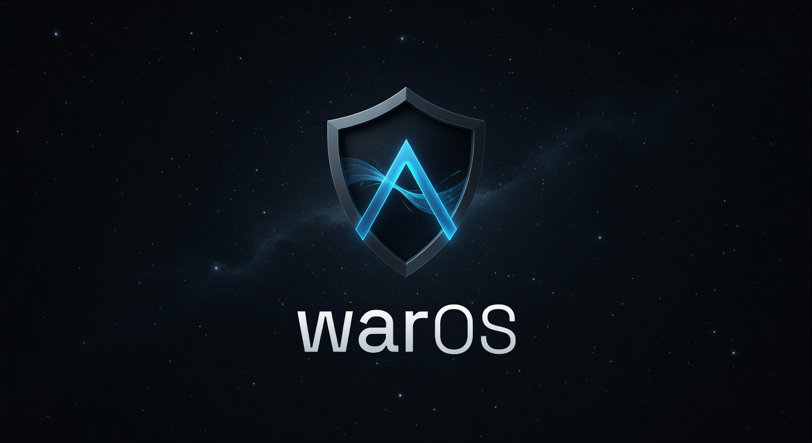

<p align="center">
  
</p>

# WarOS

[](https://github.com/WarEnterprise/waros/actions/workflows/ci.yml)
[](https://pypi.org/project/waros/)
[](LICENSE)

WarOS is a research operating-system repository from War Enterprise.

Today the repository contains two concrete deliverables:

- a tested Rust/Python quantum and post-quantum cryptography SDK that runs on conventional hardware
- a bootable x86_64 `no_std` kernel prototype with WarFS, WarShell, a narrow WarExec userspace ABI, experimental networking, and WarShield Pass 1 through Pass 4 hardening

`BLUEPRINT.md` is the architectural direction. It is not a claim that the full QRM/QHAL/QuantumIPC/Linux-compatibility design already ships.

## What WarOS Is Today

- `crates/waros-quantum`: implemented userspace statevector and MPS simulation, noise models, `OpenQASM` tooling, QEC helpers, and algorithm demos.
- `crates/waros-cli`: implemented CLI for local execution, circuit inspection, benchmarking, and IBM Quantum Runtime userspace flows.
- `crates/waros-python`: implemented Python bindings for the simulator, algorithms, QASM helpers, and crypto surfaces.
- `crates/waros-crypto`: implemented ML-KEM, ML-DSA, SLH-DSA, SHA-3/SHAKE, and simulated QRNG helpers.
- `kernel/`: bootable x86_64 kernel with framebuffer console, PS/2 shell, an 8 MiB kernel heap, WarFS RAM filesystem with virtio-blk persistence when present, DHCP/DNS/TCP/HTTP/TLS code paths, a kernel quantum simulator, and 12 CI-smoke-proven static ELF WarExec paths.
- `WarShield Pass 1 + Pass 2 + Pass 3 + Pass 4`: integrated login/logout and file-mutation audit hooks, deeper firewall enforcement across TCP/UDP/DNS/ICMP paths, ASLR on WarExec load paths, W^X enforcement on the WarExec loader path, capability checks on selected shell and system operations, signed WarPkg bundle verification against an embedded ML-DSA bootstrap root, deterministic inherit-only capability transitions across shell-process creation, spawn, and `execve`, narrow kernel TLS certificate validation for supported hosts against embedded trust anchors, and a controlled offline update path with persisted boot-health and recovery state.

## What WarOS Does Not Yet Claim

- no general Linux or POSIX compatibility layer, libc environment, `fork`, or dynamic-linking support
- no real QHAL, QRM, QuantumIPC, QuantumNet, or secure boot chain
- no browser-grade or general-purpose kernel HTTPS trust model; current kernel TLS validates only supported hosts against embedded roots and does not yet provide RTC-backed expiry checks, rotation, revocation, or a general CA store
- no broad package-ecosystem trust framework; the current kernel package path uses one embedded bootstrap ML-DSA trust root and does not yet provide key rotation, revocation, or multi-root repository metadata
- no remote update control plane, auto-update service, secure-boot linkage, or A/B slot scheme; current update handling is explicit local bundle stage/apply plus single-slot rollback preparation
- no broad POSIX credential or file-capability model; current capability semantics cover shell/session translation, spawn, and `execve` only
- no real quantum networking; the in-kernel BB84 path is a simulation, not a hardware-backed QKD link

The primary supported IBM Quantum hardware path remains userspace (`waros-quantum`, `waros-cli`, and `waros-python`). The kernel contains experimental HTTP/TLS/IBM client code and now validates supported hosts against embedded trust anchors, but the kernel HTTPS model remains intentionally narrow and should still be treated as experimental.

## Repository Layout

- `kernel/`: standalone kernel crate, image tooling, and QEMU smoke path
- `crates/waros-quantum`: userspace quantum SDK
- `crates/waros-cli`: command-line tooling
- `crates/waros-python`: Python package bindings
- `crates/waros-crypto`: post-quantum cryptography helpers
- `docs/`: architecture audit, implementation matrix, current stage summary, and ABI notes

## Quick Start

Workspace:

```bash
git clone https://github.com/WarEnterprise/waros.git
cd waros
cargo test --workspace
cargo run -p waros-cli -- qstat
cargo run -p waros-cli -- run examples/qasm/bell.qasm --shots 128
```

Optional userspace IBM Runtime build:

```bash
cargo build -p waros-quantum --features ibm
```

Optional Python bindings:

```bash
cd crates/waros-python
maturin develop --release
python -c "import waros; print(waros.__version__)"
```

Kernel build on Windows:

```powershell
cd kernel
cargo +nightly build --release --target x86_64-unknown-none
.\tools\create_image.ps1
.\tools\run_qemu.ps1
```

Kernel build on Linux/macOS:

```bash
cd kernel
cargo +nightly build --release --target x86_64-unknown-none
./tools/create_image.sh
./tools/run_qemu.sh
```

Notes:

- `kernel/tools/create_image.*` produces BIOS and UEFI disk images under `kernel/target/`.
- `kernel/tools/run_qemu_pair.*` starts a two-node serial-link setup for `net send`, `net qsend`, and `ping` experiments.
- `help quantum`, `help fs`, `help security`, `help recovery`, `security status`, `warpkg status`, `warpkg verify hello-world`, `warpkg proof`, `recovery status`, and `capabilities` are the fastest ways to inspect the current kernel command surface.
- WarFS seeds `/readme.txt`, `/sysinfo.txt`, and the current WarExec smoke binaries at boot.
- Pass 4 adds persisted update-health metadata under `/var/pkg/update-state.json`, staged offline bundles under `/var/pkg/staged`, rollback snapshots under `/var/pkg/rollback`, and a minimal recovery shell rooted at `/recovery`.

## Validation

Workspace validation:

```bash
cargo test --workspace
cargo clippy --workspace --all-targets -- -W clippy::all -W clippy::pedantic -A clippy::module_name_repetitions -A clippy::cast_possible_truncation
cargo doc --no-deps --workspace
```

Kernel validation:

```bash
cd kernel
cargo +nightly build --release --target x86_64-unknown-none
./tools/create_image.sh
sh ./tools/boot_smoke.sh
```

The current CI proves workspace build/test/clippy/doc generation, kernel build plus image creation, a headless BIOS kernel boot smoke, and Python binding tests.
The current kernel boot path also carries deterministic proofs for kernel TLS certificate validation, signed WarPkg verification, and inherit-only capability narrowing.
Pass 4 adds explicit offline-update and recovery validation surfaces through `warpkg proof`, `warpkg status`, `recovery status`, and the persisted boot-health markers emitted during boot.
Recent local QEMU validation on a reused persistent disk previously confirmed idempotent WarFS system seeding, the TLS proof, the WarPkg proof, the capability proof, the full WarExec ABI proof ladder, and shell arrival. Pass 4 extends that baseline with build-validated offline-update and recovery state surfaces for the next QEMU and hardware-real validation round.

## Documentation

- [BLUEPRINT.md](BLUEPRINT.md)
- [docs/POST_WARSHIELD_PASS4_STATUS.md](docs/POST_WARSHIELD_PASS4_STATUS.md)
- [docs/POST_WARSHIELD_PASS3_STATUS.md](docs/POST_WARSHIELD_PASS3_STATUS.md)
- [docs/PRE_PASS3_CONSOLIDATION_STATUS.md](docs/PRE_PASS3_CONSOLIDATION_STATUS.md) (historical snapshot)
- [docs/POST_WARSHIELD_PASS2_STATUS.md](docs/POST_WARSHIELD_PASS2_STATUS.md)
- [docs/WARPKG_SIGNING.md](docs/WARPKG_SIGNING.md)
- [docs/WARPKG_UPDATES_AND_RECOVERY.md](docs/WARPKG_UPDATES_AND_RECOVERY.md)
- [docs/IMPLEMENTATION_STATUS_MATRIX.md](docs/IMPLEMENTATION_STATUS_MATRIX.md)
- [docs/ARCHITECTURE_AUDIT_MARCH_2026.md](docs/ARCHITECTURE_AUDIT_MARCH_2026.md)
- [docs/WAREXEC_MINIMAL_ABI.md](docs/WAREXEC_MINIMAL_ABI.md)
- [docs/POST_WARSHIELD_PASS1_STATUS.md](docs/POST_WARSHIELD_PASS1_STATUS.md) (historical snapshot)
- [TRADEMARKS.md](TRADEMARKS.md)
- [CONTRIBUTING.md](CONTRIBUTING.md)

## License

Source code in this repository is licensed under Apache-2.0. The WarOS and War Enterprise names, logos, and brand assets are not granted for unrestricted reuse by the software license alone; see [TRADEMARKS.md](TRADEMARKS.md).
